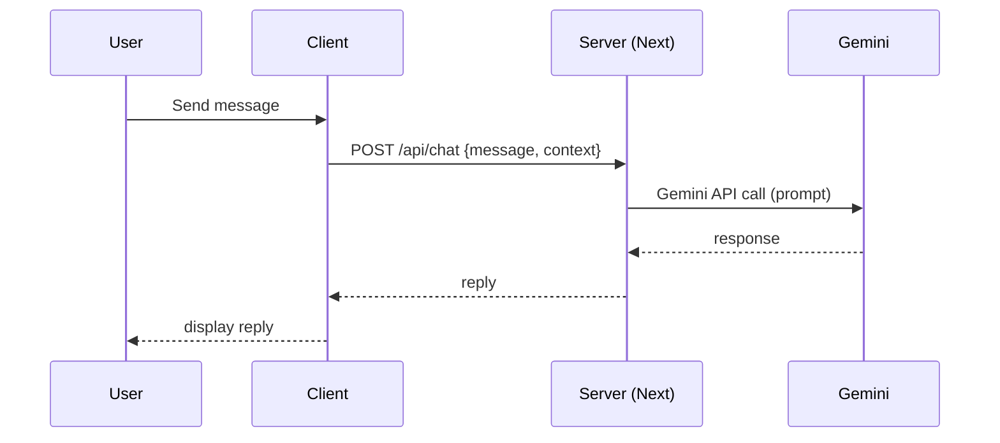

# Software Requirements Specification (SRS)

Version: 1.0

Last updated: 2026-01-22

This SRS follows the IEEE/ISO recommended structure and is tailored to an implementation using Next.js (app router), Prisma, Supabase, Clerk, shadcn/ui, and Gemini AI for chatbot assistance.

## Table of Contents
1. Introduction
2. Overall Description
3. System Requirements
4. External Interface Requirements
5. System Models (Diagrams)
6. System Quality Attributes
7. Other Requirements
8. Appendices

## 1. Introduction

### 1.1 Purpose
This document specifies the software requirements for the AI-powered Student Support System (ASSS). It is intended for project stakeholders, product owners, developers, testers, and operations engineers responsible for delivering and maintaining the system.

### 1.2 Scope
ASSS is a web-based platform that allows students to submit complaints and suggestions, interact with an AI-powered chatbot for immediate help, and enables staff to manage and resolve issues via an administrative dashboard. The implementation targets a Next.js web app backed by Supabase for real-time capabilities and storage, Prisma ORM for type-safe DB access, Clerk for authentication, shadcn/ui for UI components, and Gemini AI for chatbot responses.

### 1.3 Definitions, Acronyms, and Abbreviations
- ASSS: AI-powered Student Support System
- SRS: Software Requirements Specification
- API: Application Programming Interface
- PII: Personally Identifiable Information
- RTM: Requirements Traceability Matrix
- DB: Database
- UI: User Interface

### 1.4 References
- Project report: [docs/references/Project_Report.md](docs/references/Project_Report.md)
- Next.js documentation: https://nextjs.org/docs
- Prisma docs: https://www.prisma.io/docs
- Supabase docs: https://supabase.com/docs
- Clerk docs: https://clerk.com/docs
- shadcn/ui: https://ui.shadcn.com/
- Gemini API docs (internal): (link to API spec / project account)

### 1.5 Overview
The rest of this document describes the product perspective, features, detailed functional and non-functional requirements, interfaces, data models, diagrams, and appendices with glossary and traceability items.

## 2. Overall Description

### 2.1 Product Perspective
ASSS is a standalone web application that integrates with external services:
- Authentication: Clerk (OIDC-based SaaS)
- Database & Realtime: Supabase (Postgres + Realtime)
- Object storage: Supabase Storage (attachments)
- AI: Gemini API for chatbot responses

The backend is implemented as Next.js server and API routes (route handlers). Prisma will generate the type-safe client for DB access; Supabase is the canonical DB provider (Postgres), and Prisma connects to it.

### 2.2 Product Functions (high-level)
- User registration and authentication (Clerk)
- Student complaint creation with attachments
- Suggestion submission and voting/upvoting
- Chatbot conversation with Gemini AI with contextual prompts
- Staff dashboard to manage and respond to complaints/suggestions
- Real-time notifications and updates via Supabase Realtime
- Audit logs and basic reporting

 - Student inquiries module (conversational support, contextual ticket-aware chatbot, and generative UI assistance)

### 2.3 User Characteristics
- Students: Non-technical; need simple forms, progress tracking, and chatbot help.
- Staff: Administrative users who review, respond, and close tickets.
- Admin: Users who can configure categories, user roles, and moderate suggestions.
- Developers/Operators: Maintain the system, monitor uptime, and manage secrets.

### 2.4 Constraints
- Must use Clerk for authentication.
- Data must be hosted in Supabase (Postgres) and accessible via Prisma.
- Gemini AI integration must respect API usage limits and privacy policies.
- UI must be built with shadcn/ui and follow a11y (WCAG 2.1 AA) where practical.

### 2.5 Assumptions and Dependencies
- Supabase account, project, and API keys will be available.
- Clerk account and configuration (redirect URIs) will be provided.
- Gemini AI API access and quota will be available.
- App will initially be deployed to Vercel (or similar Next.js hosting).

### 2.6 Operational Scenarios
- Student submits a complaint, attaches a photo, and receives realtime updates as staff change status.
- Student asks a question to chatbot; chatbot uses context (recent tickets) to respond and escalate if needed.
- Staff filters complaints by category and priority, posts a response, and closes the ticket.

## 3. System Requirements

This section enumerates functional and non-functional requirements. Each functional requirement is traceable to a use case.

### 3.1 Functional Requirements

FR-001: Authentication
- Description: The system shall authenticate users via Clerk.
- Rationale: Secure access and identity management.
- Priority: High
- Acceptance Criteria: Users can sign up/sign in via Clerk; roles are assigned (STUDENT, STAFF, ADMIN).

FR-002: Submit Complaint
- Description: Authenticated students shall be able to create complaints with category, description, and optional attachments (image/pdf).
- Priority: High
- Acceptance Criteria: Complaint record created in DB, attachment stored in Supabase Storage, success response returned.

FR-003: Track Complaint Status
- Description: Students shall view status (PENDING, IN_PROGRESS, RESOLVED, CLOSED) and staff responses.
- Priority: High
- Acceptance Criteria: Status updates visible in student dashboard; timestamps stored.

FR-004: Submit Suggestion
- Description: Students shall submit suggestions with title and description.
- Priority: Medium
- Acceptance Criteria: Suggestion created and visible in suggestions feed.

FR-005: Upvote Suggestions
- Description: Authenticated users shall upvote suggestions; each user may upvote once per suggestion.
- Priority: Medium
- Acceptance Criteria: Upvote count increments; duplicate upvotes prevented.

FR-006: Chatbot Interaction
- Description: Students shall interact with a conversational chatbot integrated with Gemini AI for FAQs and triage.
- Priority: High
- Acceptance Criteria: Chat UI sends prompts to the backend, backend calls Gemini API with contextual prompt, and responses are returned and shown; escalate option to create a complaint or notify staff.

FR-011: Student Inquiries — Contextual Chat & Generative UI
- Description: The system shall provide a Student Inquiries module combining a contextual chatbot (Gemini) and a generative UI helper that can produce suggested responses, templates, or UI snippets (e.g., FAQ cards, suggested form fields, short guidance) based on student queries and institutional FAQs.
- Rationale: Improve first‑contact resolution, reduce staff workload, and provide dynamic, context-aware UI assistance.
- Priority: High
- Acceptance Criteria:
    - Chat sessions persisted (ChatSession + Message entities).
    - Chatbot receives non-PII context: recent user tickets, FAQs, and allowed metadata; Gemini responses are returned within backend limits and displayed to user.
    - Generative UI actions (e.g., `generate-faq-card`, `suggest-form-fields`) produce a JSON-backed UI prototype which the client can render safely (rendered client-side with strict sanitization and schema validation).
    - Escalation: user can convert a chat thread to a complaint (auto-fill complaint form with contextual content) or request staff attention.
    - Rate limits and cost-control: backend enforces per-user throttling and batching to limit Gemini API usage.

FR-007: Staff Dashboard
- Description: Staff shall view, filter, respond to, assign, and change the status of complaints and suggestions.
- Priority: High
- Acceptance Criteria: Staff can update `status`, add `response`, assign `owner`, and the changes appear in realtime.

FR-008: Real-time Notifications
- Description: System shall notify users of status changes and new responses using Supabase Realtime (WebSocket) or server-sent events.
- Priority: Medium
- Acceptance Criteria: Notifications delivered within 5 seconds under normal load.

FR-009: Audit Logging
- Description: System shall record audit events for create/update/delete of complaints and suggestions (user, timestamp, action).
- Priority: Medium
- Acceptance Criteria: Audit table entries exist and are queryable by admin.

FR-010: Search & Filter
- Description: Staff shall search complaints/suggestions by keywords, date ranges, category, status, and user.
- Priority: Medium
- Acceptance Criteria: Search returns relevant results within a reasonable response time (see NFRs).

### 3.2 Non-Functional Requirements

NFR-001: Performance
- 95th percentile response time for read APIs should be < 500ms under typical load (100 concurrent users).

NFR-002: Availability
- Target uptime: 99.9% monthly for the web application.

NFR-003: Scalability
- System must support horizontal scaling for Next.js serverless functions and database read replicas if needed.

NFR-004: Security
- All traffic must use TLS (HTTPS).
- Sensitive secrets use environment variables and are stored in secret managers (Vercel/hosting provider).
- All PII must be encrypted at rest where supported by Supabase (or rely on provider safeguards) and in transit.

NFR-005: Authentication & Authorization
- Use Clerk for authentication. Role-based access control (RBAC) enforced: STUDENT, STAFF, ADMIN.

NFR-006: Privacy & Data Retention
- Complaints and suggestions archived after 5 years by default; admins can change retention policy.
- Only minimal PII stored: name, email, and clerkId. Audit logs kept for 7 years (legal needs) but redact PII in export.

NFR-007: Maintainability
- Codebase should use TypeScript, unit tests, and linting rules. PRs must include tests for new functionality.

NFR-008: Accessibility
- UI shall conform to WCAG 2.1 AA for core workflows (submitting complaints, reading responses).

NFR-009: Reliability
- Automatic retries for transient errors when calling external services (Gemini, Supabase) with exponential backoff.

NFR-010: Observability
- Application must emit metrics and logs (e.g., using Vercel/hosting provider logs, and optionally a metrics exporter). Error rates monitored and alerted.

### 3.3 Interface Requirements

3.3.1 User Interfaces
- Web UI built with Next.js + shadcn/ui.
- Responsive layout supporting desktop and mobile.
- Key screens: login/signup, dashboard (student), complaint form, complaint detail, suggestions feed, staff dashboard, admin settings.
- Use consistent component library and design tokens.

3.3.2 Hardware Interfaces
- Not applicable (web-only app).

3.3.3 Software Interfaces
- REST/JSON or typed route handlers (Next.js route.ts) for API endpoints.
- External APIs:
    - Clerk: authentication and user metadata lookup
    - Supabase: Realtime, Storage, Postgres (primary DB)
    - Gemini AI: chat completions endpoint

Suggested API endpoints (example):
- POST /api/complaints - create complaint
- GET /api/complaints - list complaints (with filters)
- GET /api/complaints/:id - get complaint
- PATCH /api/complaints/:id - update status/response (staff)
- POST /api/suggestions - create suggestion
- POST /api/suggestions/:id/upvote - upvote suggestion
- POST /api/chat - send message to Gemini via backend
- GET /api/chat/sessions - list user chat sessions
- POST /api/chat/sessions - create a chat session
- POST /api/chat/sessions/:id/messages - append message (user) and receive AI reply
- POST /api/chat/sessions/:id/escalate - convert chat to complaint (auto-fill)
- POST /api/generate-ui - request a generative UI prototype (returns JSON schema + optional preview URL)

3.3.4 Communications Interfaces
- HTTPS/TLS for all requests. WebSockets (Supabase Realtime) or Server-Sent Events for live updates.

### 3.4 Data Requirements

Data Model: See Appendix A (Prisma schema). Primary entities: User, Complaint, Suggestion, AuditLog, Upvote.

Additions for Student Inquiries:
- ChatSession: tracks chat sessions per user, status (OPEN, CLOSED), lastActivity.
- Message: stores messages in session (sender: USER | AI | STAFF), content, optional metadata.
- AIResponse / UIPrototype: stores generated UI JSON (schema), prompt hash, cost estimate, and an optional signed preview URL for rendered preview stored in Supabase Storage (short-lived).

Data Integrity:
- Use DB-level constraints (foreign keys, unique constraints) and application-level validation.

Data Migration:
- Use Prisma migrations for schema changes. Provide migration scripts and seeders for initial categories and roles.

Backup & Recovery:
- Rely on Supabase backup features. Document recovery RTO/RPO; test periodic restore in staging.

Privacy and PII:
- Collect minimal PII; store Clerk identifiers to link accounts; encrypt stored attachments; obtain consent via terms during signup.

### 3.5 System Constraints
- Supported browsers: latest two versions of Chrome, Edge, Firefox, Safari (desktop and mobile).
- Node.js LTS version supported by Next.js at time of development.

### 3.6 Safety and Compliance
- Follow local data protection regulations (GDPR if applicable).
- Provide data export and deletion endpoints for user requests.

### 3.7 Availability, Reliability, Maintainability
- Monitoring and alerting for backend errors and high latency.
- Regular backups and documented restore process.

### 3.8 Security Requirements
- Role-based access control enforced on server routes.
- Input validation and sanitization to avoid injection attacks.
- Rate-limiting to mitigate abuse (both on public endpoints and AI endpoints).

### 3.9 Privacy and Data Protection
- Users may request data export or deletion; implement endpoints to comply with rights to access and erasure.

## 4. External Interface Requirements

4.1 Clerk (Authentication)
- Flow: OIDC redirect -> Clerk -> callback to Next.js -> session created server-side.
- Store `clerkId` in `User` table.

4.2 Supabase (Database & Realtime)
- Supabase hosts primary Postgres DB. Prisma connects to the DB using standard Postgres connection string.
- Supabase Realtime used to push notifications to clients.

4.3 Gemini AI
- Backend will call Gemini's chat or completion endpoint. Backend must implement a prompt template that includes: user question, non-sensitive context (e.g., FAQs), and optionally non-PII ticket metadata.
- Responses are logged for auditing; sensitive inputs must be redacted.

4.4 Storage (Attachments)
- Use Supabase Storage with signed URLs for uploads and downloads.

## 5. System Models (Diagrams)

5.1 High-Level Architecture

```mermaid
flowchart TD
    subgraph Client
        A[Next.js Web App (shadcn/ui)]
    end
    subgraph API
        B[Next.js API Routes]
        G[Server-side: Chat & Orchestration]
    end
    subgraph Services
        C[Prisma (Postgres)]
        D[Supabase Realtime & Storage]
        E[Clerk Auth]
        F[Gemini AI]
    end
    A -- Auth --> E
    A -- API --> B
    B -- DB --> C
    C -- hosted_on --> D
    B -- call --> F
    A -- Realtime --> D
```

5.2 Deployment Diagram

```mermaid
flowchart TD
    User[Browser]
    Vercel[Next.js (Vercel)]
    Supabase[Supabase Cloud]
    Clerk[Clerk Service]
    Gemini[Gemini API]
    User -- HTTPS --> Vercel
    Vercel -- HTTPS --> Supabase
    Vercel -- HTTPS --> Clerk
    Vercel -- HTTPS --> Gemini
    Supabase -- Realtime --> Vercel/Client
```

5.3 Chat Sequence (simplified)



## 6. System Quality Attributes

- Performance: 95th percentile read response < 500ms.
- Scalability: stateless Next.js functions, horizontal scale.
- Accessibility: WCAG 2.1 AA for critical flows.
- Security: TLS-all, RBAC, secrets in env, audit logging.

## 7. Other Requirements

7.1 Internationalization & Localization
- English by default. UI strings isolated for future i18n.

7.2 Accessibility
- Keyboard navigable forms, ARIA labels for inputs, sufficient color contrast.

7.3 Legal and Compliance
- Data handling and retention policies documented and available to admin.

## 8. Appendices

Appendix A — Prisma Data Model

```prisma
generator client {
    provider = "prisma-client-js"
}

datasource db {
    provider = "postgresql"
    url      = env("DATABASE_URL")
}

model User {
    id           String   @id @default(cuid())
    clerkId      String   @unique
    email        String   @unique
    name         String?
    role         Role     @default(STUDENT)
    complaints   Complaint[]
    suggestions  Suggestion[]
    upvotes      Upvote[]
    createdAt    DateTime @default(now())
    updatedAt    DateTime @updatedAt
}

model Complaint {
    id          String   @id @default(cuid())
    userId      String
    user        User     @relation(fields: [userId], references: [id])
    category    String
    description String
    status      ComplaintStatus @default(PENDING)
    response    String?
    attachment  String?
    assigneeId  String?  
    assignee    User?    @relation("Assignee", fields: [assigneeId], references: [id])
    createdAt   DateTime @default(now())
    updatedAt   DateTime @updatedAt
}

model Suggestion {
    id          String   @id @default(cuid())
    userId      String
    user        User     @relation(fields: [userId], references: [id])
    title       String
    description String
    status      SuggestionStatus @default(PENDING)
    upvotes     Int      @default(0)
    createdAt   DateTime @default(now())
    updatedAt   DateTime @updatedAt
}

model Upvote {
    id           String @id @default(cuid())
    userId       String
    suggestionId String
    createdAt    DateTime @default(now())
    @@unique([userId, suggestionId])
}

model AuditLog {
    id        String   @id @default(cuid())
    actorId   String?
    action    String
    entity    String
    entityId  String
    detail    String?
    createdAt DateTime @default(now())
}

model ChatSession {
    id          String   @id @default(cuid())
    userId      String
    user        User     @relation(fields: [userId], references: [id])
    status      ChatStatus @default(OPEN)
    title       String?
    lastActivity DateTime @updatedAt
    messages    Message[]
    createdAt   DateTime @default(now())
}

model Message {
    id          String   @id @default(cuid())
    sessionId   String
    session     ChatSession @relation(fields: [sessionId], references: [id])
    sender      MessageSender
    content     String
    metadata    Json?
    createdAt   DateTime @default(now())
}

model UIPrototype {
    id          String   @id @default(cuid())
    sessionId   String?  
    promptHash  String
    schemaJson  Json
    previewPath String?  // optional Supabase Storage path for rendered preview
    costCents   Int?     // approximate cost tracking for AI call
    createdAt   DateTime @default(now())
}

enum Role {
    STUDENT
    STAFF
    ADMIN
}

enum ComplaintStatus {
    PENDING
    IN_PROGRESS
    RESOLVED
    CLOSED
}

enum SuggestionStatus {
    PENDING
    APPROVED
    REJECTED
}

enum ChatStatus {
    OPEN
    CLOSED
}

enum MessageSender {
    USER
    AI
    STAFF
}
```

Appendix B — Requirements Traceability Matrix (RTM) (starter)

| Req ID | Requirement Summary                 | Use Case / Feature | Test Case ID |
|--------|--------------------------------------|--------------------|--------------|
| FR-001 | Authentication via Clerk             | UC01               | TC-Auth-01   |
| FR-002 | Submit Complaint                     | UC02               | TC-Comp-01   |
| FR-006 | Chatbot Interaction (Gemini)         | UC05               | TC-Chat-01   |

Appendix C — Glossary

- Complaint: A report of an issue requiring staff attention.
- Suggestion: User-proposed idea for improvement.
- Upvote: A user's endorsement of a suggestion.

Appendix D — Revision History

| Version | Date       | Author | Notes |
|---------|------------|--------|-------|
| 1.0     | 2026-01-20 | Team   | Initial draft |
| 1.1     | 2026-01-22 | You    | Expanded IEEE-style SRS tailored to chosen stack |

---

If you want, I can:
- generate a CSV/JSON RTM export linking these requirement IDs to future test cases,
- scaffold API route handlers and types for the endpoints in the [app/api](app/api) folder,
- or produce sample prompt templates and backend code to safely call Gemini AI.

Files changed: [docs/SRS.md](docs/SRS.md)